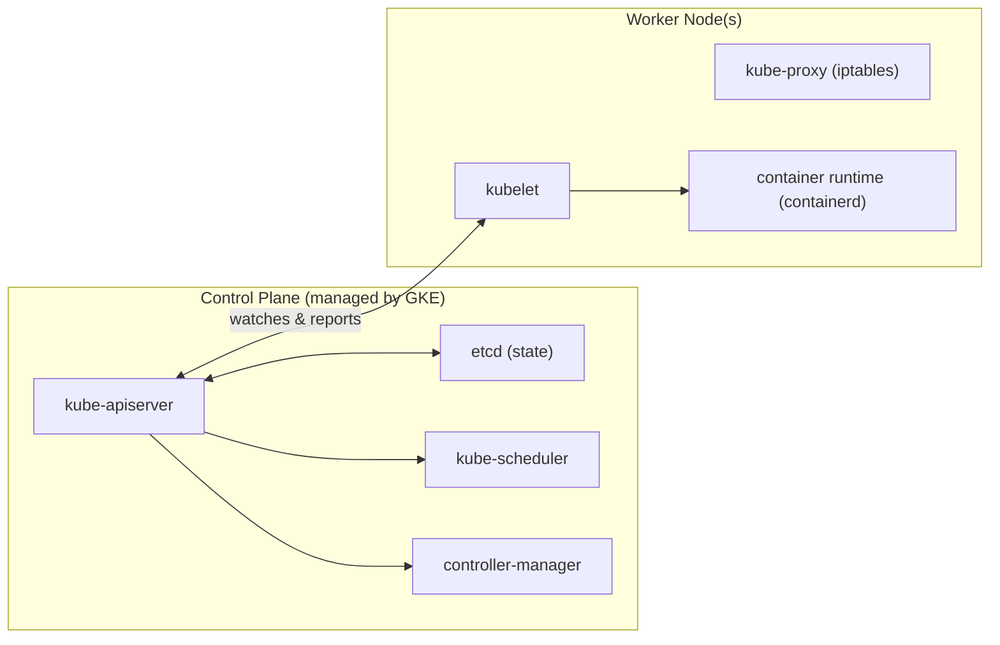

# Kubernetes Tutorial

> Environment: GKE cluster `icsg-cluster`, project `str-22391`, zone `asia-southeast1-a`
> Access: via service account key `str-22391-gke.json`

**How to read this file:** Every section opens with a restaurant analogy to build intuition, then follows with the technical detail and hands-on exercises. The analogy and the technical reality map 1-to-1.

---

## Table of Contents

1. [Architecture Overview](#1-architecture-overview)
2. [Connecting to the Cluster](#2-connecting-to-the-cluster)
3. [Namespaces](#3-namespaces)
4. [Pods](#4-pods)
5. [Labels and Selectors](#5-labels-and-selectors)
6. [Deployments and ReplicaSets](#6-deployments-and-replicasets)
7. [Services](#7-services)
8. [ConfigMaps and Secrets](#8-configmaps-and-secrets)
9. [Persistent Storage](#9-persistent-storage)
10. [Jobs and CronJobs](#10-jobs-and-cronjobs)
11. [Resource Limits and Requests](#11-resource-limits-and-requests)
12. [Health Checks (Probes)](#12-health-checks-probes)
13. [Putting It All Together](#13-putting-it-all-together)
14. [Quick Reference](#14-quick-reference)

---

## 1. Architecture Overview

### The Restaurant Analogy

Kubernetes is a restaurant. Everything that happens — from taking an order to cooking to serving — has a direct parallel in K8s.

| Restaurant | Kubernetes |
|---|---|
| The entire restaurant operation | Cluster |
| Management team (owner + head chef) | Control Plane |
| Individual kitchen stations (grill, pastry, cold) | Worker Nodes |

The **management team never cooks**. Their job is to coordinate, monitor, and ensure everything matches what was ordered. The **kitchen stations** do the actual work.

### The Management Team (Control Plane)

| Restaurant Role | K8s Component | What it does |
|---|---|---|
| **Maître d'** at the front door | `kube-apiserver` | Every request — from customers, staff, suppliers — must go through them. Nothing happens without their knowledge. |
| **Reservation and order book** | `etcd` | The single source of truth. If the book says 3 dishes, that's reality. |
| **Floor manager** | `kube-scheduler` | Decides which kitchen station handles a new order based on who has capacity. |
| **Roving supervisor** | `controller-manager` | Walks the floor constantly comparing what *should* be happening against what *is* happening. If something is wrong, they fix it. |

### The Kitchen Stations (Worker Nodes)

Each kitchen station has:
- A **chef in charge** (`kubelet`) who receives orders and executes them
- A **pass-through window** (`kube-proxy`) that routes food (network traffic) to the right table
- The actual **cooking equipment** (`containerd`) that does the real work

### Technical: Cluster Components

Kubernetes (K8s) is a **container orchestration platform**. Its job is to:
- Schedule containers across a cluster of machines
- Keep them running (restart on failure)
- Scale them up/down
- Wire up networking between them
- Manage configuration and secrets



**Control Plane components:**

| Component | Role |
|---|---|
| `kube-apiserver` | The front door. All kubectl commands go here. Validates and stores requests in etcd. |
| `etcd` | Distributed key-value store. The single source of truth for all cluster state. |
| `kube-scheduler` | Decides which node a new Pod should run on, based on resource availability and constraints. |
| `controller-manager` | Runs control loops that continuously reconcile actual state with desired state (e.g. "I want 3 replicas, I see 2, create 1 more"). |

**Worker Node components:**

| Component | Role |
|---|---|
| `kubelet` | Agent running on each node. Receives Pod specs from the API server and tells the container runtime to start/stop containers. |
| `kube-proxy` | Manages network rules (iptables) to route traffic to the correct Pod for each Service. |
| Container runtime | Actually runs containers. GKE uses `containerd`. |

### The Reconciliation Loop (Core Mental Model)

**In restaurant terms:**

> The reservation book says Table 5 needs 3 dishes of pasta.
> The roving supervisor walks past and counts only 2 dishes being prepared.
> They immediately tell the floor manager: "We're short one pasta — start another."
> This check happens every few seconds, forever.

**Technically:** Kubernetes is **declarative** — you tell it the *desired state*, and it figures out how to get there. Controllers continuously watch actual state and reconcile toward desired state. This is why K8s self-heals.

```
You declare: "I want 3 nginx pods"
         |
         v
   kube-apiserver stores this in etcd
         |
         v
   controller-manager detects desired=3, actual=0
         |
         v
   scheduler assigns pods to nodes
         |
         v
   kubelet on each node starts containers
         |
         v
   actual=3  (reconciled)
```

**Spot nodes = temporary contract staff.** Sometimes the staffing agency pulls them mid-shift with no warning. The restaurant (K8s) adapts — pods are rescheduled elsewhere automatically.

---

## 2. Connecting to the Cluster

### Authenticate and configure kubectl

```bash
# Authenticate with Google (opens browser)
gcloud auth login

# Point kubectl at your cluster
export GOOGLE_APPLICATION_CREDENTIALS=/mnt/d/docs/training/k8s/str-22391-gke.json
gcloud container clusters get-credentials icsg-cluster --zone asia-southeast1-a
gcloud config set project str-22391

# Verify connection
kubectl config current-context
# Should show: gke_str-22391_asia-southeast1-a_icsg-cluster
```

### Essential kubectl patterns

```bash
# General syntax
kubectl <verb> <resource-type> [name] [flags]

# Common verbs
kubectl get        # list resources
kubectl describe   # detailed info about a resource
kubectl apply      # create/update from a YAML file (declarative)
kubectl create     # create a resource (imperative)
kubectl delete     # delete a resource
kubectl logs       # view container logs
kubectl exec       # run a command inside a container
kubectl port-forward  # forward a local port to a pod

# Output formats
kubectl get pods -o wide       # extra columns (node, IP)
kubectl get pods -o yaml       # full YAML definition
kubectl get pods -o json       # full JSON definition
```

### Exercise 2.1 — Explore the cluster

```bash
# See all nodes in the cluster
kubectl get nodes

# Describe one node to see its capacity, labels, and running pods
kubectl describe node <node-name>

# See ALL pods running across all namespaces
kubectl get pods -A

# See all resource types K8s knows about
kubectl api-resources
```

---

## 3. Namespaces

### The Restaurant Analogy

The restaurant has separate sections:

- **Fine dining room** — premium setup, separate staff
- **Casual dining area** — relaxed, different rules
- **Staff canteen** — internal use only (`kube-system`)
- **Takeaway counter** — different workflow entirely

A "Table 5" in fine dining is completely different from "Table 5" in casual dining — same name, different section. Staff in one section don't accidentally interfere with another.

### Technical Concept

A **Namespace** is a virtual cluster inside your physical cluster. It provides:
- **Isolation**: resources in different namespaces don't interfere
- **Scope**: names must be unique *within* a namespace, not globally
- **Access control**: RBAC policies can be scoped per namespace
- **Resource quotas**: limit total CPU/memory per namespace

```
Cluster
├── namespace: kube-system   (K8s internal components — the staff canteen)
├── namespace: kube-public   (publicly readable data)
├── namespace: default       (where your stuff goes if unspecified)
└── namespace: your-name     (your personal sandbox)
```

**Note:** Some resources are cluster-scoped (not namespaced): Nodes, PersistentVolumes, ClusterRoles, StorageClasses.

### Commands

```bash
# List all namespaces
kubectl get namespaces

# Create a namespace
kubectl create namespace my-namespace

# Work in a specific namespace with -n flag
kubectl get pods -n kube-system

# Set a default namespace for your session (so you don't need -n every time)
kubectl config set-context --current --namespace=my-namespace

# Reset back to default
kubectl config set-context --current --namespace=default
```

### Exercise 3.1 — Create your personal namespace

Use your name or initials to avoid clashing with other cluster users. All subsequent exercises should use this namespace.

```bash
# Replace 'yourname' with your actual name/initials
kubectl create namespace yourname

# Verify it was created
kubectl get namespaces | grep yourname

# Set it as your default for this session
kubectl config set-context --current --namespace=yourname
```

---

## 4. Pods

### The Restaurant Analogy

A **Pod** is one active cooking slot at a kitchen station.

- It's **temporary by nature** — once the dish is done (or the chef burns it), the slot is cleared
- Each slot gets its own section of counter space and its own assigned order ticket (IP address)
- If the pod dies, that counter space is cleared and a fresh slot is opened elsewhere — but only if a higher-level rule (like a Deployment) demands it

A pod usually has **one container = one chef**. Rarely, you put two chefs at the same slot (sidecar pattern) — e.g., a main chef and an assistant who plates the dish. They share the same counter space and can talk to each other directly on `localhost`.

### Technical Concept

A **Pod** is the smallest deployable unit in Kubernetes. A Pod:
- Wraps one or more containers (usually one)
- All containers in a Pod share:
  - The same network namespace (same IP address, same localhost)
  - The same storage volumes
- Pods are **ephemeral**: they are not self-healing. If a Pod dies, it stays dead unless a higher-level controller (like a Deployment) recreates it.

### Pod Lifecycle

```
Pending  -->  Running  -->  Succeeded
                  |
                  v
               Failed
```

| Phase | Meaning |
|---|---|
| `Pending` | Pod accepted but not yet running. May be waiting for scheduling or image pull. |
| `Running` | Pod has been bound to a node and at least one container is running. |
| `Succeeded` | All containers exited with code 0. Common for batch Jobs. |
| `Failed` | At least one container exited with non-zero code. |
| `Unknown` | Node is unreachable (common with spot instances). |

### Pod YAML Structure

Every Kubernetes object follows the same top-level structure:

```yaml
apiVersion: v1        # Which API version defines this resource
kind: Pod             # What type of resource
metadata:             # Identity and labels
  name: my-pod
  namespace: yourname
  labels:
    app: nginx
spec:                 # The desired state - what you want
  containers:
  - name: nginx
    image: nginx:1.25
    ports:
    - containerPort: 80
```

### Running a Pod

**Imperative (quick, for testing):**
```bash
kubectl run my-pod --image=nginx:1.25 --namespace=yourname
```

**Declarative (recommended for anything real):**
```bash
# Save to a file and apply it
kubectl apply -f pod.yaml
```

### Exercise 4.1 — Run your first Pod

```bash
# Run a simple nginx pod imperatively
kubectl run nginx-pod --image=nginx:1.25

# Watch it start up (Ctrl+C to stop watching)
kubectl get pods -w

# Get detailed information about the pod
kubectl describe pod nginx-pod

# Check what's running inside via logs
kubectl logs nginx-pod

# Open a shell inside the running container
kubectl exec -it nginx-pod -- /bin/bash
# Inside the container:
#   curl localhost      <- nginx responds!
#   exit

# Clean up
kubectl delete pod nginx-pod
```

### Exercise 4.2 — Write and apply a Pod manifest

Create a file `pod.yaml`:

```yaml
apiVersion: v1
kind: Pod
metadata:
  name: web-pod
  labels:
    app: web
    env: training
spec:
  containers:
  - name: nginx
    image: nginx:1.25
    ports:
    - containerPort: 80
    resources:
      requests:
        memory: "64Mi"
        cpu: "50m"
      limits:
        memory: "128Mi"
        cpu: "100m"
```

```bash
kubectl apply -f pod.yaml

# See the pod
kubectl get pod web-pod -o wide

# See the full spec K8s has stored (includes defaults K8s added)
kubectl get pod web-pod -o yaml

# Delete it
kubectl delete -f pod.yaml
```

**Key insight:** `kubectl apply -f` is idempotent — running it multiple times is safe. It creates if missing, updates if changed.

### Multi-container Pods (Sidecar Pattern)

Sometimes you put multiple containers in one Pod. Classic use case: a sidecar that handles a cross-cutting concern (logging, proxying). Like a main chef and an assistant who plates — they share the same workstation.

```yaml
apiVersion: v1
kind: Pod
metadata:
  name: multi-container-pod
spec:
  containers:
  - name: main-app
    image: nginx:1.25
    volumeMounts:
    - name: shared-logs
      mountPath: /var/log/nginx
  - name: log-sidecar
    image: busybox
    command: ["sh", "-c", "tail -f /logs/access.log"]
    volumeMounts:
    - name: shared-logs
      mountPath: /logs
  volumes:
  - name: shared-logs
    emptyDir: {}    # Temporary directory shared between containers
```

Both containers share the `shared-logs` volume and the same IP — they talk to each other on `localhost`.

---

## 5. Labels and Selectors

### The Restaurant Analogy

Every order ticket has tags stuck to it:

```
[app: pasta] [env: dine-in] [priority: VIP] [allergen: gluten-free]
```

These tags let staff quickly filter and find orders:
- "Show me all gluten-free orders"
- "What VIP orders are still in the kitchen?"

Labels are how Kubernetes connects objects together. A Service finds its Pods by matching labels, exactly like a waiter finding all orders for a specific table by looking at the table number tag.

### Technical Concept

**Labels** are key/value pairs attached to any K8s object. They are the primary mechanism for grouping and selecting objects.

```yaml
metadata:
  labels:
    app: nginx
    env: production
    version: "1.25"
    team: backend
```

**Selectors** filter objects by labels. They are used:
- By Services to find which Pods to route traffic to
- By Deployments to find which Pods they own
- In `kubectl get` to filter output

### Label Operations

```bash
# Add/overwrite a label on a running pod
kubectl label pod my-pod version=v2

# Remove a label (dash suffix)
kubectl label pod my-pod version-

# Filter by label
kubectl get pods -l app=nginx
kubectl get pods -l env=production,app=nginx    # AND logic
kubectl get pods -l 'env in (production,staging)'
kubectl get pods -l 'env notin (dev)'
```

### Exercise 5.1 — Labels and selectors

```bash
# Create a few pods with different labels
kubectl run pod-prod --image=nginx:1.25 --labels="app=nginx,env=prod"
kubectl run pod-staging --image=nginx:1.25 --labels="app=nginx,env=staging"
kubectl run pod-other --image=busybox --labels="app=other,env=prod" -- sleep 3600

# List all pods
kubectl get pods --show-labels

# Filter: only nginx pods
kubectl get pods -l app=nginx

# Filter: only prod pods
kubectl get pods -l env=prod

# Filter: prod AND nginx
kubectl get pods -l app=nginx,env=prod

# Clean up
kubectl delete pod pod-prod pod-staging pod-other
```

---

## 6. Deployments and ReplicaSets

### The Restaurant Analogy

**ReplicaSet = A Staffing Requirement**

> "We must always have **3 chefs on the grill station** during dinner service."

If a chef calls in sick (pod dies), the shift manager immediately calls in a replacement. If someone extra shows up, they're sent home. The count is maintained. Always.

**Deployment = The Full HR Policy + Upgrade Process**

The Deployment adds upgrade management on top:
- How many chefs we need (replicas)
- What skills they need (container image)
- How to handle a **recipe change** without closing the kitchen (rolling update)

**Rolling update = cross-training staff without closing the kitchen:**

> "We're switching from the old pasta recipe to the new one.
> Don't retrain all 3 chefs at once — the kitchen would grind to a halt.
> Bring in one chef trained on the new recipe.
> Once they're up to speed, let one old-recipe chef go home.
> Repeat until all 3 are on the new recipe.
> If the new recipe is a disaster — rollback: bring the old chefs back."

Zero downtime. One chef is always cooking.

### Technical Concept

**ReplicaSet:** Ensures a specified number of Pod replicas are running at any time. Uses a label selector to identify which Pods it manages. You rarely create ReplicaSets directly — Deployments do it for you.

**Deployment** manages ReplicaSets and adds:
- **Rolling updates**: gradually replace old Pods with new ones (zero downtime)
- **Rollback**: revert to a previous version if something goes wrong
- **Declarative updates**: just change the image tag and apply — Deployment handles the rest

```
Deployment
  └── ReplicaSet (v1 - old, being wound down)
  └── ReplicaSet (v2 - new, being scaled up)
        ├── Pod
        ├── Pod
        └── Pod
```

### Creating a Deployment

```yaml
apiVersion: apps/v1
kind: Deployment
metadata:
  name: nginx-deployment
spec:
  replicas: 3                    # How many Pods to maintain
  selector:
    matchLabels:
      app: nginx                 # This Deployment manages Pods with this label
  template:                      # Pod template - what each Pod looks like
    metadata:
      labels:
        app: nginx               # Must match selector above
    spec:
      containers:
      - name: nginx
        image: nginx:1.24        # Start with older version to demo upgrade
        ports:
        - containerPort: 80
        resources:
          requests:
            memory: "64Mi"
            cpu: "50m"
          limits:
            memory: "128Mi"
            cpu: "100m"
```

### Deployment Update Strategies

```yaml
spec:
  strategy:
    type: RollingUpdate          # Default. The other option is Recreate (causes downtime).
    rollingUpdate:
      maxSurge: 1                # Max extra pods during update (above desired count)
      maxUnavailable: 0          # Max pods that can be unavailable during update
```

With `maxUnavailable: 0` and `maxSurge: 1`: new pod starts, then old pod dies. Zero downtime.

### Exercise 6.1 — Deploy and scale

```bash
# Create the deployment
kubectl create deployment nginx-deploy --image=nginx:1.24 --replicas=3

# Watch pods come up
kubectl get pods -w

# Check the deployment status
kubectl get deployment nginx-deploy
kubectl describe deployment nginx-deploy

# See the ReplicaSet it created
kubectl get replicaset

# Scale up to 5 replicas
kubectl scale deployment nginx-deploy --replicas=5
kubectl get pods

# Scale down to 2
kubectl scale deployment nginx-deploy --replicas=2
kubectl get pods
```

### Exercise 6.2 — Rolling update and rollback

```bash
# Update the image to a newer version
kubectl set image deployment/nginx-deploy nginx=nginx:1.25

# Watch the rolling update happen
kubectl rollout status deployment/nginx-deploy
kubectl get pods -w   # (in a second terminal)

# Check rollout history
kubectl rollout history deployment/nginx-deploy

# Rollback to previous version
kubectl rollout undo deployment/nginx-deploy

# Verify it rolled back
kubectl rollout history deployment/nginx-deploy
kubectl describe deployment nginx-deploy | grep Image

# Clean up
kubectl delete deployment nginx-deploy
```

**What happened during the rolling update:**
1. Deployment created a new ReplicaSet for `nginx:1.25`
2. New ReplicaSet scaled up one Pod at a time
3. Old ReplicaSet scaled down one Pod at a time
4. Old ReplicaSet remained at 0 replicas (kept for rollback history)

### Exercise 6.3 — Deployment via YAML file

Save as `deployment.yaml`:

```yaml
apiVersion: apps/v1
kind: Deployment
metadata:
  name: web-deploy
  labels:
    app: web
spec:
  replicas: 2
  selector:
    matchLabels:
      app: web
  strategy:
    type: RollingUpdate
    rollingUpdate:
      maxSurge: 1
      maxUnavailable: 0
  template:
    metadata:
      labels:
        app: web
    spec:
      containers:
      - name: nginx
        image: nginx:1.25
        ports:
        - containerPort: 80
        resources:
          requests:
            memory: "64Mi"
            cpu: "50m"
          limits:
            memory: "128Mi"
            cpu: "100m"
```

```bash
kubectl apply -f deployment.yaml
kubectl get deployment web-deploy
kubectl get pods -l app=web

# Edit the replicas in the YAML from 2 to 4, then:
kubectl apply -f deployment.yaml   # K8s diffs and applies only changes

kubectl delete -f deployment.yaml
```

---

## 7. Services

### The Restaurant Analogy

A **Service** is a waiter assigned to a section.

You (the customer) never go directly to the kitchen. You tell the waiter what you want. The waiter knows which kitchen station handles your type of order and routes it there. If one station is overwhelmed, they route to another.

**You don't care which specific chef makes your pasta — you just want pasta.**

Pods come and go (chefs change shifts), but the waiter (Service) is always there with the same name and the same table assignment.

| Service Type | Restaurant Equivalent |
|---|---|
| **ClusterIP** | The **kitchen intercom** — staff-only, internal communication between stations. Customers can't hear it. |
| **NodePort** | A **direct window on the side of the building** — technically accessible from outside, but awkward. Used for testing. |
| **LoadBalancer** | The **main restaurant phone number** — one number, routes your call to whoever is available. This is what customers actually use. |

**DNS in the restaurant:**
Every waiter has a name everyone in the building knows: `pasta-station.fine-dining.restaurant.local`. You don't memorize their phone extension — just call their name.

### Technical Concept

Pods are ephemeral and get new IP addresses when recreated. A **Service** provides a stable network endpoint (IP + DNS name) that routes traffic to a set of Pods, selected by label.

| Type | Description | When to use |
|---|---|---|
| `ClusterIP` | Internal IP only, accessible within the cluster | Pod-to-pod communication |
| `NodePort` | Opens a port (30000-32767) on every node's IP | Testing/dev, direct node access |
| `LoadBalancer` | Provisions a cloud load balancer (GCP LB here) with an external IP | Exposing apps to the internet |
| `ExternalName` | Maps a Service to an external DNS name | Aliasing external services |

### How a Service routes traffic

```
Client request
     |
     v
Service (stable ClusterIP: 10.96.0.1:80)
     |
     v  (kube-proxy matches labels)
     +--> Pod (app=nginx, IP: 10.244.1.5)
     +--> Pod (app=nginx, IP: 10.244.2.3)
     +--> Pod (app=nginx, IP: 10.244.3.8)
```

The Service uses **iptables rules** (managed by kube-proxy) to load balance across matching Pods. It continuously updates as Pods come and go.

### ClusterIP Service

```yaml
apiVersion: v1
kind: Service
metadata:
  name: web-service
spec:
  type: ClusterIP        # Default if type is omitted
  selector:
    app: web             # Routes to Pods with this label
  ports:
  - port: 80             # Port the Service listens on
    targetPort: 80       # Port on the Pod to forward to
    protocol: TCP
```

### LoadBalancer Service (GKE)

On GKE, a LoadBalancer Service automatically provisions a Google Cloud Load Balancer with an external IP.

```yaml
apiVersion: v1
kind: Service
metadata:
  name: web-lb
spec:
  type: LoadBalancer
  selector:
    app: web
  ports:
  - port: 80
    targetPort: 80
```

### DNS in Kubernetes

Every Service gets a DNS name automatically:
```
<service-name>.<namespace>.svc.cluster.local
```

Pods in the same namespace can use just `<service-name>`. Cross-namespace requires the full name.

### Exercise 7.1 — Expose a Deployment with a Service

```bash
# Create a deployment
kubectl create deployment web --image=nginx:1.25 --replicas=2

# Expose it with a LoadBalancer Service
kubectl expose deployment web --type=LoadBalancer --port=80 --target-port=80

# Watch for the external IP to be assigned (takes 1-2 minutes)
kubectl get service web -w

# Once EXTERNAL-IP is not <pending>, open it:
# Copy the external IP and open http://<EXTERNAL-IP> in your browser

# Alternatively, use port-forward to test without an external IP
kubectl port-forward deployment/web 8080:80
# Now open http://localhost:8080
```

### Exercise 7.2 — ClusterIP and pod-to-pod communication

```bash
# Create backend deployment
kubectl create deployment backend --image=nginx:1.25 --replicas=2

# Expose it as ClusterIP (internal only)
kubectl expose deployment backend --type=ClusterIP --port=80

# Get the ClusterIP
kubectl get service backend

# Now run a temporary pod to test connectivity from inside the cluster
kubectl run test-pod --image=curlimages/curl --rm -it --restart=Never -- \
  curl http://backend:80
# 'backend' resolves via K8s DNS: <service-name>.<namespace>.svc.cluster.local

# Full DNS name also works:
kubectl run test-pod --image=curlimages/curl --rm -it --restart=Never -- \
  curl http://backend.yourname.svc.cluster.local:80

# Clean up
kubectl delete deployment web backend
kubectl delete service web backend
```

---

## 8. ConfigMaps and Secrets

### The Restaurant Analogy

**ConfigMap = Laminated recipe cards on the kitchen wall**

Publicly visible, easy to update, not sensitive:
- Oven temperature settings
- Standard plating instructions
- Today's specials board

Any chef (container) can read them. When management updates the instructions, all stations see the change.

**Secret = The head chef's locked safe**

The safe in the back office holds things that must not be visible to everyone:
- The secret spice blend (API keys)
- The supplier's confidential pricing (passwords)
- The franchise's proprietary recipe (TLS certificates)

Chefs who need it get the information injected directly into their workstation — they use it without ever seeing the safe itself. You never write the combination (plaintext password) on a public whiteboard (in your git repo).

### Technical Concept

Hard-coding configuration inside container images is bad practice. Kubernetes provides two objects to inject configuration into Pods:

| Object | Purpose | Stored as |
|---|---|---|
| `ConfigMap` | Non-sensitive configuration | Plain text in etcd |
| `Secret` | Sensitive data (passwords, tokens, certs) | Base64-encoded in etcd |

**Note:** Secrets are base64-encoded, not encrypted by default. On GKE, application-layer encryption can be enabled. Never store secrets in YAML files committed to git — use tools like Sealed Secrets or external secret managers in production.

### ConfigMap

```yaml
apiVersion: v1
kind: ConfigMap
metadata:
  name: app-config
data:
  DATABASE_HOST: "postgres-service"
  DATABASE_PORT: "5432"
  LOG_LEVEL: "info"
  config.properties: |
    server.port=8080
    server.timeout=30
```

### Secret

```yaml
apiVersion: v1
kind: Secret
metadata:
  name: app-secret
type: Opaque
data:
  # Values must be base64-encoded: echo -n 'mypassword' | base64
  DATABASE_PASSWORD: bXlwYXNzd29yZA==
  API_KEY: c2VjcmV0a2V5MTIz
```

Or create imperatively:
```bash
kubectl create secret generic app-secret \
  --from-literal=DATABASE_PASSWORD=mypassword \
  --from-literal=API_KEY=secretkey123
```

### Injecting into Pods — Two methods

**Method 1: Environment variables**
```yaml
spec:
  containers:
  - name: app
    image: myapp:1.0
    env:
    - name: DB_HOST
      valueFrom:
        configMapKeyRef:
          name: app-config
          key: DATABASE_HOST
    - name: DB_PASSWORD
      valueFrom:
        secretKeyRef:
          name: app-secret
          key: DATABASE_PASSWORD
    envFrom:                    # Load ALL keys from ConfigMap as env vars
    - configMapRef:
        name: app-config
```

**Method 2: Volume mounts (files)**
```yaml
spec:
  containers:
  - name: app
    image: myapp:1.0
    volumeMounts:
    - name: config-vol
      mountPath: /etc/config      # Each key becomes a file here
  volumes:
  - name: config-vol
    configMap:
      name: app-config
```

### Exercise 8.1 — ConfigMap and Secret

```bash
# Create a ConfigMap
kubectl create configmap app-config \
  --from-literal=LOG_LEVEL=debug \
  --from-literal=APP_PORT=8080

kubectl describe configmap app-config

# Create a Secret
kubectl create secret generic app-secret \
  --from-literal=DB_PASSWORD=supersecret

kubectl describe secret app-secret
kubectl get secret app-secret -o yaml

# Decode a secret value
kubectl get secret app-secret -o jsonpath='{.data.DB_PASSWORD}' | base64 -d
echo    # newline
```

Save as `pod-with-config.yaml`:

```yaml
apiVersion: v1
kind: Pod
metadata:
  name: config-pod
spec:
  containers:
  - name: busybox
    image: busybox
    command: ["sh", "-c", "env && sleep 3600"]
    env:
    - name: LOG_LEVEL
      valueFrom:
        configMapKeyRef:
          name: app-config
          key: LOG_LEVEL
    - name: DB_PASSWORD
      valueFrom:
        secretKeyRef:
          name: app-secret
          key: DB_PASSWORD
```

```bash
kubectl apply -f pod-with-config.yaml

# Verify the env vars were injected
kubectl logs config-pod | grep -E "LOG_LEVEL|DB_PASSWORD"

# Or check interactively
kubectl exec -it config-pod -- env | grep -E "LOG_LEVEL|DB_PASSWORD"

# Clean up
kubectl delete pod config-pod
kubectl delete configmap app-config
kubectl delete secret app-secret
```

---

## 9. Persistent Storage

### The Restaurant Analogy

Most things chefs work with are temporary — a cutting board is cleaned and reused, prep bowls are washed. When a pod dies, its local filesystem is gone.

But the **walk-in refrigerator** (PersistentVolume) holds ingredients that must survive between shifts:
- The veal stock that's been reducing for 3 days
- The sourdough starter that's been cultivated for months

When the morning chef (Pod) leaves, the refrigerator doesn't get emptied. The afternoon chef (new Pod) opens the same refrigerator and continues from where the morning chef left off.

**PVC = a reservation tag on a specific shelf in the fridge.** "This shelf is reserved for the pasta station, 1 square meter." The fridge (PV) exists independently; the reservation (PVC) connects a specific station (Pod) to its shelf.

### Technical Concept

Containers are ephemeral — their filesystem is destroyed when the container stops. For data that must survive restarts (databases, uploaded files), you need persistent storage.

```
Pod lifecycle:   Created --> Running --> Deleted
Container FS:    Created --> Data     --> GONE
PersistentVol:   Created --> Data     --> STILL THERE --> Reattached to new Pod
```

### Storage Objects

| Object | Role |
|---|---|
| `PersistentVolume (PV)` | A piece of storage in the cluster (provisioned by admin or dynamically). Cluster-scoped. |
| `PersistentVolumeClaim (PVC)` | A request for storage by a user. Like a ticket that gets matched to a PV. |
| `StorageClass` | Defines how to dynamically provision storage. GKE has a default that creates GCP Persistent Disks. |

### How it works

```
Developer creates PVC  -->  K8s finds/creates matching PV  -->  Pod mounts PVC
        |                            |
  "I need 5Gi,                "Provisioning a
   ReadWriteOnce"              GCP Persistent Disk"
```

### Dynamic Provisioning (GKE)

```yaml
# PersistentVolumeClaim
apiVersion: v1
kind: PersistentVolumeClaim
metadata:
  name: my-pvc
spec:
  accessModes:
  - ReadWriteOnce          # RWO: one node at a time (most disks)
                           # RWX: many nodes at once (NFS, etc)
  resources:
    requests:
      storage: 1Gi
  storageClassName: standard   # GKE's default StorageClass (creates GCP PD)
```

```yaml
# Pod that uses the PVC
apiVersion: v1
kind: Pod
metadata:
  name: storage-pod
spec:
  containers:
  - name: app
    image: nginx:1.25
    volumeMounts:
    - name: data
      mountPath: /usr/share/nginx/html   # Where to mount inside container
  volumes:
  - name: data
    persistentVolumeClaim:
      claimName: my-pvc                  # Reference the PVC by name
```

### Access Modes

| Mode | Short | Meaning |
|---|---|---|
| `ReadWriteOnce` | RWO | One node can read/write. Multiple pods on same node can share. |
| `ReadOnlyMany` | ROX | Many nodes can read. None can write. |
| `ReadWriteMany` | RWX | Many nodes can read and write. Requires NFS or similar. |

### Exercise 9.1 — Create and use persistent storage

```bash
# Check available StorageClasses
kubectl get storageclass

# Create a PVC
kubectl apply -f - <<EOF
apiVersion: v1
kind: PersistentVolumeClaim
metadata:
  name: test-pvc
spec:
  accessModes:
  - ReadWriteOnce
  resources:
    requests:
      storage: 1Gi
  storageClassName: standard-rwo
EOF

# Check PVC status (it will be Pending until a Pod uses it)
kubectl get pvc test-pvc

# Create a pod that uses it
kubectl apply -f - <<EOF
apiVersion: v1
kind: Pod
metadata:
  name: storage-pod
spec:
  containers:
  - name: writer
    image: busybox
    command: ["sh", "-c", "echo 'hello persistent world' > /data/hello.txt && sleep 3600"]
    volumeMounts:
    - name: storage
      mountPath: /data
  volumes:
  - name: storage
    persistentVolumeClaim:
      claimName: test-pvc
EOF

# Wait for pod to be Running
kubectl get pod storage-pod -w

# Read the file that was written to persistent storage
kubectl exec storage-pod -- cat /data/hello.txt

# PVC should now be Bound
kubectl get pvc test-pvc

# Delete the pod
kubectl delete pod storage-pod

# Create a NEW pod using the SAME PVC
kubectl apply -f - <<EOF
apiVersion: v1
kind: Pod
metadata:
  name: storage-pod-2
spec:
  containers:
  - name: reader
    image: busybox
    command: ["sh", "-c", "sleep 3600"]
    volumeMounts:
    - name: storage
      mountPath: /data
  volumes:
  - name: storage
    persistentVolumeClaim:
      claimName: test-pvc
EOF

# The file written by the first pod is still there!
kubectl exec storage-pod-2 -- cat /data/hello.txt

# Clean up (PVC must be deleted explicitly; it won't go away when pod dies)
kubectl delete pod storage-pod-2
kubectl delete pvc test-pvc
```

---

## 10. Jobs and CronJobs

### The Restaurant Analogy

**Job = A One-Time Catering Event**

A client books the restaurant for a private event. Staff are assigned, the event runs, everyone goes home. It's not an ongoing service — it has a clear start and end. If it fails mid-way, you retry.

Examples: running a database migration before launch, generating an end-of-month report, sending 50,000 welcome emails once.

**CronJob = The Daily Prep Schedule**

```
Every morning at 7am: prep vegetables
Every Sunday at 10pm: clean the deep fryer
Every 1st of the month: take full inventory
```

These happen automatically on a schedule. No one needs to remember to kick them off.

### Technical Concept

**Job:** Runs a Pod to completion (exit code 0) and guarantees it succeeds. Unlike Deployments, Jobs are for **batch/finite** work, not long-running services.

```yaml
apiVersion: batch/v1
kind: Job
metadata:
  name: hello-job
spec:
  completions: 3           # Run this pod 3 times successfully total
  parallelism: 1           # Run at most 1 at a time (increase for parallel batch)
  backoffLimit: 4          # Retry up to 4 times on failure
  template:
    spec:
      restartPolicy: Never  # Jobs must be Never or OnFailure (not Always)
      containers:
      - name: hello
        image: busybox
        command: ["sh", "-c", "echo Hello from job && date"]
```

**CronJob:** Creates Jobs on a schedule (standard cron syntax).

```yaml
apiVersion: batch/v1
kind: CronJob
metadata:
  name: hello-cron
spec:
  schedule: "*/2 * * * *"   # Every 2 minutes
  jobTemplate:
    spec:
      template:
        spec:
          restartPolicy: OnFailure
          containers:
          - name: hello
            image: busybox
            command: ["sh", "-c", "echo Cron ran at $(date)"]
```

### Exercise 10.1 — Run a Job

```bash
# Create a job that runs a simple calculation
kubectl apply -f - <<EOF
apiVersion: batch/v1
kind: Job
metadata:
  name: pi-job
spec:
  template:
    spec:
      restartPolicy: Never
      containers:
      - name: pi
        image: perl:5.34
        command: ["perl", "-Mbignum=bpi", "-wle", "print bpi(100)"]
EOF

# Watch the job
kubectl get jobs -w

# See the pod it created
kubectl get pods -l job-name=pi-job

# Get the output
kubectl logs -l job-name=pi-job

# Clean up
kubectl delete job pi-job
```

### Exercise 10.2 — Create a CronJob

```bash
kubectl apply -f - <<EOF
apiVersion: batch/v1
kind: CronJob
metadata:
  name: echo-cron
spec:
  schedule: "*/1 * * * *"
  successfulJobsHistoryLimit: 3
  failedJobsHistoryLimit: 1
  jobTemplate:
    spec:
      template:
        spec:
          restartPolicy: OnFailure
          containers:
          - name: echo
            image: busybox
            command: ["sh", "-c", "echo CronJob ran at $(date)"]
EOF

# Wait a minute, then check
kubectl get cronjob echo-cron
kubectl get jobs    # New job created each minute

# See logs from the most recent job
kubectl logs -l job-name=$(kubectl get jobs -o name | head -1 | cut -d/ -f2)

# Clean up
kubectl delete cronjob echo-cron
```

---

## 11. Resource Limits and Requests

### The Restaurant Analogy

Each kitchen station has a **budget**:

| K8s Term | Restaurant Term |
|---|---|
| `requests` | The **minimum guaranteed** burners and counter space. The scheduler won't assign your station to a kitchen that doesn't have at least this much available. |
| `limits` | The **maximum allowed**. You cannot commandeer more burners than your limit, even if others are idle. If you try to use too much memory (pantry space), you get evicted. |

**QoS Classes — eviction priority when spot nodes disappear:**
- **Guaranteed** (requests == limits): The sous chef. Last to be asked to leave.
- **Burstable** (requests < limits): Regular chef. Asked to leave if things get tight.
- **BestEffort** (no limits set): The intern. First to go.

### Technical Concept

Without limits, one misbehaving pod can starve the entire node. K8s uses two settings:

| Setting | Meaning |
|---|---|
| `requests` | The **minimum** guaranteed resources. Used by the scheduler to find a node with enough capacity. |
| `limits` | The **maximum** allowed. Container is throttled (CPU) or killed (memory) if it exceeds this. |

```
Node capacity: 4 CPU, 8Gi RAM

Pod A requests: 1 CPU, 2Gi  <-- scheduler reserves this
Pod B requests: 2 CPU, 4Gi  <-- scheduler reserves this
                               Remaining schedulable: 1 CPU, 2Gi

If Pod A tries to use 3 CPU: throttled back to its limit
If Pod A tries to use 4Gi RAM: OOMKilled (Out Of Memory)
```

### Units

- **CPU**: `1` = 1 core, `500m` = 0.5 cores, `100m` = 0.1 cores
- **Memory**: `128Mi` = 128 mebibytes, `1Gi` = 1 gibibyte

```yaml
resources:
  requests:
    memory: "128Mi"
    cpu: "100m"
  limits:
    memory: "256Mi"
    cpu: "500m"
```

### Quality of Service (QoS) Classes

K8s assigns pods a QoS class that determines eviction priority (spot nodes often evict):

| Class | Condition | Priority |
|---|---|---|
| `Guaranteed` | requests == limits for all containers | Highest (last to be evicted) |
| `Burstable` | requests < limits or only some set | Medium |
| `BestEffort` | No requests or limits set | Lowest (first to be evicted) |

### Exercise 11.1 — Observe resource usage

```bash
# Check node capacity and allocatable resources
kubectl describe nodes | grep -A 5 "Capacity:"
kubectl describe nodes | grep -A 5 "Allocatable:"

# Check resource usage per pod
kubectl top pods        # Requires metrics-server (available on GKE by default)
kubectl top nodes
```

---

## 12. Health Checks (Probes)

### The Restaurant Analogy

**Readiness Probe = "Is this dish ready to serve?"**

The expeditor checks every dish before it leaves the kitchen. If the dish isn't ready yet, the waiter won't pick it up — no matter how many orders are waiting. This prevents customers from getting half-cooked food.

In K8s: traffic only reaches a Pod once its readiness probe passes. A pod still booting or connecting to its database won't receive requests yet.

**Liveness Probe = "Is this station still functional?"**

The supervisor periodically checks each station: "Is the grill still on? Is anyone cooking?"

If a station is found completely non-functional (a chef fell asleep at the burner), the supervisor **closes that station and opens a fresh one**. The container is restarted.

| Probe | Failed result | Restaurant analogy |
|---|---|---|
| **Readiness** | Stop sending traffic here | "Don't seat customers — this table isn't set yet" |
| **Liveness** | Restart the container | "This station is broken — close it and open a fresh one" |

### Technical Concept

| Probe | Purpose | Action on failure |
|---|---|---|
| `livenessProbe` | Is the container still alive? | Restart the container |
| `readinessProbe` | Is the container ready to receive traffic? | Remove from Service endpoints (no restart) |
| `startupProbe` | Has the container finished starting up? | Kills container if it takes too long |

Without probes:
- K8s sends traffic to a Pod before it's ready (errors during startup)
- K8s keeps routing to a Pod that's deadlocked or crashed

### Probe Types

```yaml
# HTTP check - most common for web services
livenessProbe:
  httpGet:
    path: /healthz
    port: 8080
  initialDelaySeconds: 10   # Wait before first probe
  periodSeconds: 10          # How often to probe
  failureThreshold: 3        # Failures before action

# TCP check - for non-HTTP services (databases, etc)
livenessProbe:
  tcpSocket:
    port: 5432
  initialDelaySeconds: 5
  periodSeconds: 10

# Command check - run a command, success = exit 0
livenessProbe:
  exec:
    command:
    - cat
    - /tmp/healthy
  initialDelaySeconds: 5
  periodSeconds: 5
```

### Exercise 12.1 — Liveness probe in action

```bash
kubectl apply -f - <<EOF
apiVersion: v1
kind: Pod
metadata:
  name: liveness-pod
spec:
  containers:
  - name: app
    image: busybox
    command: ["sh", "-c"]
    args:
    - |
      # Create healthy file initially
      touch /tmp/healthy
      # After 30 seconds, remove it to simulate failure
      sleep 30
      rm /tmp/healthy
      # Sleep forever
      sleep 600
    livenessProbe:
      exec:
        command:
        - cat
        - /tmp/healthy
      initialDelaySeconds: 5
      periodSeconds: 5
      failureThreshold: 3
EOF

# Watch pod - after ~45s, it will restart due to failed liveness probe
kubectl get pod liveness-pod -w

# See restart count go up and probe events
kubectl describe pod liveness-pod

# Clean up
kubectl delete pod liveness-pod
```

### Exercise 12.2 — Readiness probe

```bash
kubectl apply -f - <<EOF
apiVersion: v1
kind: Pod
metadata:
  name: readiness-pod
  labels:
    app: readiness-test
spec:
  containers:
  - name: nginx
    image: nginx:1.25
    readinessProbe:
      httpGet:
        path: /
        port: 80
      initialDelaySeconds: 5
      periodSeconds: 5
EOF

kubectl apply -f - <<EOF
apiVersion: v1
kind: Service
metadata:
  name: readiness-svc
spec:
  selector:
    app: readiness-test
  ports:
  - port: 80
    targetPort: 80
EOF

# Pod is only added to Service endpoints when readiness probe passes
kubectl get endpoints readiness-svc

# Clean up
kubectl delete pod readiness-pod
kubectl delete service readiness-svc
```

---

## 13. Putting It All Together

### The Full Restaurant Loop

Here's what happens when management decides: *"We want 3 portions of our new pasta recipe always available, served to dine-in customers."*

1. **You** write this requirement in the **order book (etcd)** via the **maître d' (API server)**
2. The **roving supervisor (controller manager)** sees: desired=3 chefs on new recipe, actual=0
3. The **floor manager (scheduler)** finds 3 kitchen stations (nodes) with enough capacity
4. Each station's **chef in charge (kubelet)** starts a **cooking slot (pod)** using the new recipe (container image), with:
   - The **recipe card (ConfigMap)** pinned to the station
   - The **secret spice blend (Secret)** injected directly
   - A shelf in the **walk-in fridge (PVC)** if needed
5. Before each slot opens for orders, the **expeditor (readiness probe)** checks it's ready
6. The **head waiter (Service / LoadBalancer)** is told: *"Route pasta orders to whoever has the `app: pasta` tag"*
7. Customer orders arrive. Waiter routes to any of the 3 available slots
8. The supervisor **continuously checks** (every few seconds) that 3 slots are running. If one breaks, open a new one
9. When you update the recipe: **new chefs replace old ones one at a time** (rolling update), kitchen never goes dark

### Exercise 13.1 — Deploy a complete application stack

Deploy a small app with: Deployment + ConfigMap + Secret + Service with probes.

```bash
# Step 1: Create namespace for this exercise
kubectl create namespace fullstack-demo
kubectl config set-context --current --namespace=fullstack-demo
```

Save as `fullstack.yaml`:

```yaml
---
apiVersion: v1
kind: ConfigMap
metadata:
  name: app-config
  namespace: fullstack-demo
data:
  NGINX_HOST: "localhost"
  NGINX_PORT: "80"

---
apiVersion: v1
kind: Secret
metadata:
  name: app-secret
  namespace: fullstack-demo
type: Opaque
data:
  # echo -n 'changeme' | base64
  ADMIN_PASSWORD: Y2hhbmdlbWU=

---
apiVersion: apps/v1
kind: Deployment
metadata:
  name: web-app
  namespace: fullstack-demo
spec:
  replicas: 3
  selector:
    matchLabels:
      app: web-app
  strategy:
    type: RollingUpdate
    rollingUpdate:
      maxSurge: 1
      maxUnavailable: 0
  template:
    metadata:
      labels:
        app: web-app
        version: "1.0"
    spec:
      containers:
      - name: nginx
        image: nginx:1.25
        ports:
        - containerPort: 80
        envFrom:
        - configMapRef:
            name: app-config
        env:
        - name: ADMIN_PASSWORD
          valueFrom:
            secretKeyRef:
              name: app-secret
              key: ADMIN_PASSWORD
        resources:
          requests:
            memory: "64Mi"
            cpu: "50m"
          limits:
            memory: "128Mi"
            cpu: "200m"
        readinessProbe:
          httpGet:
            path: /
            port: 80
          initialDelaySeconds: 5
          periodSeconds: 5
        livenessProbe:
          httpGet:
            path: /
            port: 80
          initialDelaySeconds: 15
          periodSeconds: 10

---
apiVersion: v1
kind: Service
metadata:
  name: web-service
  namespace: fullstack-demo
spec:
  type: LoadBalancer
  selector:
    app: web-app
  ports:
  - port: 80
    targetPort: 80
```

```bash
kubectl apply -f fullstack.yaml

# Watch everything come up
kubectl get all -n fullstack-demo -w

# When LoadBalancer gets an external IP, open it in browser
kubectl get service web-service -n fullstack-demo

# Verify env vars are injected
kubectl exec -it deploy/web-app -n fullstack-demo -- env | grep -E "NGINX|ADMIN"

# Test rolling update: change image to nginx:alpine in fullstack.yaml, then:
kubectl apply -f fullstack.yaml
kubectl rollout status deployment/web-app -n fullstack-demo

# Clean up everything in the namespace
kubectl delete namespace fullstack-demo
```

---

## 14. Quick Reference

### One-Page Analogy Summary

```
RESTAURANT                          KUBERNETES
═══════════════════════════════════════════════════════════════
The whole operation                 Cluster
Management team                     Control Plane
  Maître d'                           API Server
  Reservation/order book              etcd
  Floor manager                       Scheduler
  Roving supervisor                   Controller Manager
Kitchen station                     Worker Node
  Chef in charge                      kubelet
  Pass-through window                 kube-proxy
  Cooking equipment                   Container runtime (containerd)
Active cooking slot                 Pod
Chef at the slot                    Container
Restaurant section (fine/casual)    Namespace
Tags on order tickets               Labels
"Always keep 3 chefs on grill"      Deployment / ReplicaSet
Waiter routing orders               Service
  Kitchen intercom (staff only)       ClusterIP
  Side window (awkward)               NodePort
  Main phone number                   LoadBalancer
Laminated recipe cards on wall      ConfigMap
Head chef's locked safe             Secret
Walk-in refrigerator                PersistentVolume
Shelf reservation in the fridge     PersistentVolumeClaim
One-time catering event             Job
Daily prep schedule                 CronJob
Station burner/counter budget       Resource Requests & Limits
"Is this dish ready to serve?"      Readiness Probe
"Is this station still working?"    Liveness Probe
Train new chefs while serving       Rolling Update
Bring back old chefs (bad recipe)   Rollback
```

### Most-used kubectl Commands

```bash
# Context / namespace
kubectl config current-context
kubectl config set-context --current --namespace=<ns>
kubectl get namespaces

# Pods
kubectl get pods [-n ns] [-o wide] [-w] [--show-labels]
kubectl describe pod <name>
kubectl logs <pod> [-c container] [-f]
kubectl exec -it <pod> -- /bin/bash
kubectl delete pod <name>

# Deployments
kubectl get deployments
kubectl describe deployment <name>
kubectl scale deployment <name> --replicas=N
kubectl set image deployment/<name> <container>=<image>:<tag>
kubectl rollout status deployment/<name>
kubectl rollout history deployment/<name>
kubectl rollout undo deployment/<name>

# Services
kubectl get services
kubectl describe service <name>
kubectl port-forward pod/<name> <local>:<remote>
kubectl port-forward deployment/<name> <local>:<remote>

# Apply / delete
kubectl apply -f file.yaml
kubectl delete -f file.yaml
kubectl apply -f .    # apply all yamls in current directory

# Debugging
kubectl get events --sort-by=.metadata.creationTimestamp
kubectl describe pod <name>       # look at Events section at bottom
kubectl top pods
kubectl top nodes
```

### Resource Types Short Names

| Full name | Short |
|---|---|
| `pods` | `po` |
| `services` | `svc` |
| `deployments` | `deploy` |
| `replicasets` | `rs` |
| `namespaces` | `ns` |
| `configmaps` | `cm` |
| `persistentvolumeclaims` | `pvc` |
| `persistentvolumes` | `pv` |
| `nodes` | `no` |

```bash
# Short names work everywhere
kubectl get po
kubectl get svc
kubectl get deploy
```

### Generating YAML Stubs (very useful)

```bash
# Generate pod YAML without creating it
kubectl run my-pod --image=nginx --dry-run=client -o yaml > pod.yaml

# Generate deployment YAML
kubectl create deployment my-deploy --image=nginx --dry-run=client -o yaml > deploy.yaml

# Generate service YAML
kubectl expose deployment my-deploy --port=80 --dry-run=client -o yaml > svc.yaml
```

Use `--dry-run=client -o yaml` to generate YAML templates instead of typing from scratch.

---

## Next Steps

Once comfortable with these basics, explore:

- **Helm**: Package manager for Kubernetes. Bundles multiple K8s objects into reusable "charts".
- **Ingress**: Route external HTTP traffic to multiple services by path/hostname (vs one LoadBalancer per service).
- **StatefulSets**: Like Deployments but for stateful apps (databases). Pods get stable names and dedicated storage.
- **DaemonSets**: Run exactly one pod per node. Used for log collectors, monitoring agents.
- **RBAC**: Role-Based Access Control — who can do what in the cluster.
- **HPA**: Horizontal Pod Autoscaler — automatically scale replicas based on CPU/memory.
- **NetworkPolicies**: Firewall rules between pods.
